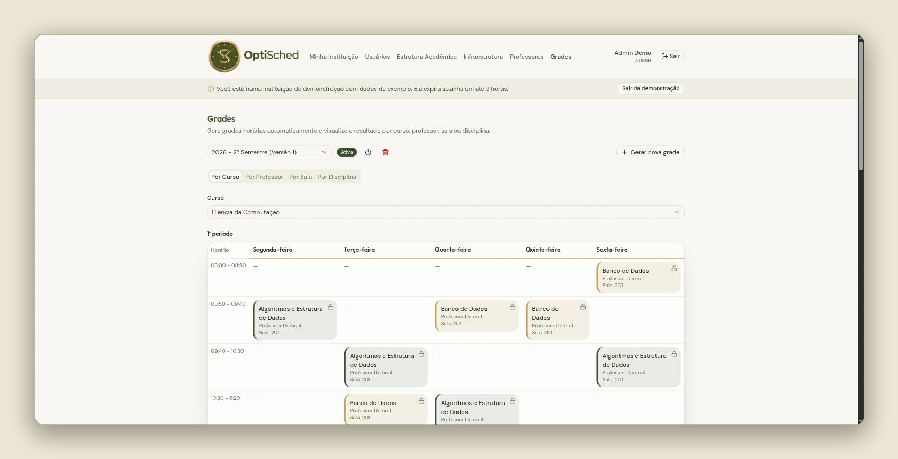
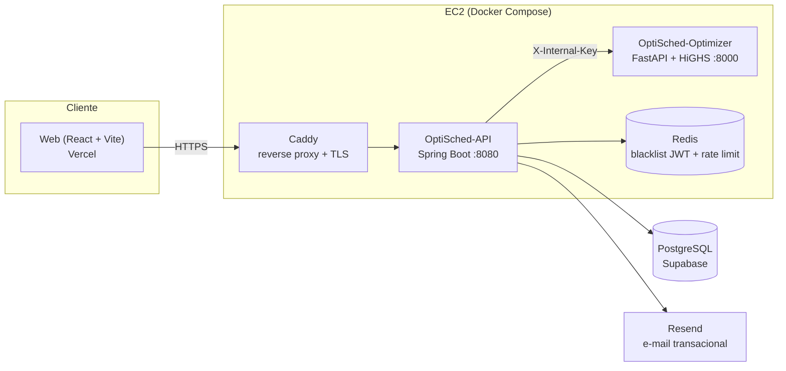

# OptiSched

Geração automática de grades horárias acadêmicas com programação linear inteira mista (MILP) — o usuário cadastra professores, disciplinas, salas e disponibilidades, e o sistema monta a grade completa do período letivo em segundos, sem conflitos de horário, sala ou qualificação.

**Demo ao vivo:** [optisched.com.br/demo](https://www.optisched.com.br/demo) (escolha "Universidade" ou "Escola" — provisiona uma instituição de exemplo na hora, sem login) · **API:** `https://api.optisched.com.br` · CI/CD completo (testes → build de imagens → deploy) via GitHub Actions — ver [`.github/workflows/ci.yml`](.github/workflows/ci.yml).

<p align="center">
  
</p>


## Sobre o projeto

Montar a grade horária de uma instituição de ensino manualmente é um problema combinatório clássico: professores acabam alocados em horários em que não estão disponíveis, salas ficam sem capacidade suficiente, aulas obrigatórias se sobrepõem. Feito à mão (ou em planilha), o processo é lento e o erro geralmente só aparece depois que as aulas já começaram. O OptiSched resolve isso com um motor de otimização matemática dedicado: a partir dos dados cadastrados (professores, disciplinas, salas, disponibilidades, qualificações), o sistema gera a grade inteira já validada contra todas as regras institucionais, com garantia formal de que nenhuma restrição rígida é violada — a garantia vem do próprio modelo, não de validação posterior.

O projeto é dividido em três serviços com responsabilidades bem separadas. A **API** (Java/Spring Boot) é dona do domínio, da persistência e da autenticação — é ela quem monta o payload do problema de otimização e recebe o resultado. O **Optimizer** (Python/FastAPI) é um serviço stateless que só resolve o problema matemático: recebe um snapshot de dados via HTTP, monta o modelo MILP (conjuntos, parâmetros, variáveis de decisão e restrições, documentado formalmente em [`OptimizationModel.md`](OptiSched-Optimizer/OptimizationModel.md)) e devolve a grade ótima usando o solver [HiGHS](https://highs.dev/). Separar otimização da API permite escalar e testar o solver de forma isolada, e trocar sua implementação sem tocar no domínio — o contrato entre os dois é só o payload HTTP, fechado por um header compartilhado (`X-Internal-Key`) já que o Optimizer não tem autenticação própria. O **Web** (React/TypeScript) é o cliente que consome a API.

Duas decisões técnicas guiam boa parte do design: primeiro, o modelo de currículo é dual — uma instituição pode operar no modo Universidade (curso → semestre) ou Escola (série → turma), com o `InstitutionType` decidindo qual conjunto de entidades e regras se aplica, permitindo atender os dois tipos de instituição sem duplicar o motor de otimização. Segundo, o pipeline de CI/CD (GitHub Actions) roda suíte de testes real por serviço — incluindo Testcontainers subindo Postgres e Redis de verdade para os testes de integração da API — mais scanner de vulnerabilidades de dependências (OWASP Dependency-Check, `npm audit`, `pip-audit`) antes de buildar e publicar as imagens no GHCR e fazer deploy automático na EC2, com smoke test pós-deploy no endpoint de health.

## Tecnologias

**Backend (API)** — Java 21, Spring Boot 3.5 (Web, Data JPA, Security, OAuth2 Resource Server, Validation, AOP, Actuator, Data Redis), PostgreSQL, Flyway (26 migrations), Redis, Lombok, springdoc-openapi (Swagger UI), Maven, JUnit 5 + Testcontainers.

**Motor de otimização (Optimizer)** — Python 3.14, FastAPI, [HiGHS](https://highs.dev/) via `highspy` (solver MILP), Pydantic, Uvicorn, pytest.

**Frontend (Web)** — React 19, TypeScript, Vite 8, TanStack Router (file-based routing) + TanStack Query, Tailwind CSS 4, Base UI, React Hook Form + Zod, i18n (`i18next`, locale `pt-BR`), Axios.

**Infraestrutura** — Docker / Docker Compose, Caddy (reverse proxy + TLS automático), GitHub Actions (CI/CD), GHCR (registro de imagens), AWS EC2 (deploy da API + Optimizer + Redis + Caddy), Vercel (deploy do frontend), Supabase (Postgres gerenciado em produção), Resend (envio de e-mail transacional).

## Como rodar localmente

Pré-requisitos: Docker + Docker Compose, Node.js 22, JDK 21 e Python 3.14 apenas se quiser rodar algum serviço fora de container.

```bash
git clone https://github.com/vini3006/OptiSched.git
cd OptiSched
```

**1. Variáveis de ambiente da API/Optimizer/Postgres** — copie o exemplo e ajuste o necessário (os defaults já funcionam para dev local):

```bash
cp .env.example .env
```

**2. Par de chaves RSA para assinar os JWTs** (a API usa OAuth2 Resource Server com chave assimétrica; os arquivos `app.key`/`app.pub` são referenciados pelo `docker-compose.yml` e não são versionados):

```bash
openssl genrsa -out app.key 2048
openssl rsa -in app.key -pubout -out app.pub
```

**3. Suba a API, o Optimizer, o Postgres e o Redis via Docker Compose:**

```bash
docker compose up -d
```

Isso sobe: `postgres` (5432), `redis`, `optimizer` (8000) e `api` (8080, com Flyway rodando as migrations e criando o super-admin a partir de `SUPER_ADMIN_EMAIL`/`SUPER_ADMIN_PASSWORD_HASH` do `.env`). Health check da API: `http://localhost:8080/actuator/health`. Documentação da API (Swagger UI, habilitada por padrão em dev): `http://localhost:8080/swagger-ui.html`.

**4. Rode o frontend separadamente** (fora do compose, com hot reload):

```bash
cd OptiSched-Web
npm install
npm run dev
```

Abre em `http://localhost:5173`, já apontando para a API local por padrão.

### Rodando os testes

```bash
# API (sobe Postgres/Redis reais via Testcontainers — requer Docker rodando)
cd OptiSched-API && ./mvnw test

# Optimizer
cd OptiSched-Optimizer && pip install -r requirements-dev.txt && pytest

# Web (type-check + build)
cd OptiSched-Web && npm run build
```

## Arquitetura

Três serviços independentes, cada um com seu próprio ciclo de deploy e imagem Docker. A API é a única com estado além do banco (nenhum, na verdade — é stateless, todo estado vive no Postgres/Redis); o Optimizer é puramente stateless e sem autenticação própria, protegido por um header interno compartilhado com a API.



Fluxo de geração de grade: o frontend dispara a geração pela API; a API monta um snapshot dos dados da instituição (professores, disciplinas, salas, disponibilidades, qualificações) e envia ao Optimizer; o Optimizer resolve o modelo MILP com HiGHS (restrições formalizadas em [`OptimizationModel.md`](OptiSched-Optimizer/OptimizationModel.md): qualificação, disponibilidade, capacidade de sala, exclusividade de recursos, entre outras) e devolve as alocações; a API persiste o resultado como `ScheduleEntry`s versionados.

Em produção, apenas o Caddy expõe portas para a internet — API, Optimizer e Redis só são alcançáveis pela rede interna do Docker. O Postgres não roda em container em produção (é o Supabase gerenciado); em dev local, sim, via `docker-compose.yml`.

---

Repositório: estrutura em monorepo com três pastas de primeiro nível — [`OptiSched-API`](OptiSched-API), [`OptiSched-Optimizer`](OptiSched-Optimizer) e [`OptiSched-Web`](OptiSched-Web) — cada uma com seu próprio `Dockerfile`, buildado e publicado independentemente pelo pipeline de CI.
